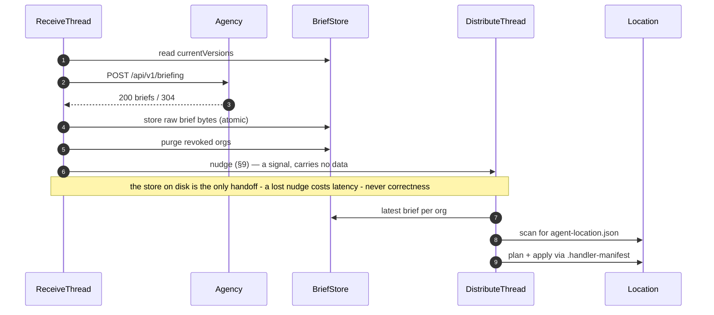

# Handler — Core Sync Engine Design

Status: proposed
Date: 2026-07-26
Supersedes: the POC in `dev.theagencyhq.daemon` (`Updater`, `FilesResponse`, `SyncFile`)

## 1. Purpose

The Handler is the daemon that runs on a developer's machine. It is the conduit between The Agency and the Agents working at Locations on that machine. It does two things on independent schedules:

1. **Receive** — ask The Agency for new Briefs and store them locally, immutably.
2. **Distribute** — find every Location on the machine and make the files in that Location match the Brief its Organization published.

Neither task translates, decodes, or interprets Brief content beyond what is needed to write bytes to disk. The Handler is a courier, not an author.

## 2. Scope

**In scope for this spec**

- Configuration loading (`~/.config/the-agency-hq/handler.json`) with XDG-aware path resolution
- The Agency API client, authenticated with a bearer token read from config
- The Brief store — per-Organization, per-version, immutable, never pruned
- Location discovery by `agent-location.json` marker
- Mission Type filtering
- The `.handler-manifest` apply algorithm, including git exclude management
- The two service threads and process lifecycle
- A minimal CLI: `handler daemon`, `handler sync [--force]`, `handler status`
- Logging to stderr and a rotating file
- A test-only fake Agency plus frozen contract fixtures

**Out of scope (separate specs)**

- OAuth / FusionAuth device flow and refresh-grant token renewal. Until then, `accessToken` in `handler.json` is a static bearer token. The client reads it through a `TokenSupplier` interface so the OAuth implementation is a drop-in.
- `handler init` (needs an Agency API listing Organization names and ids) and `handler login`
- Desktop crash notifications
- launchd / systemd unit generation (`handler install`). Reference units are in Appendix A.
- Shipping audit events to The Agency
- Windows

**Platform**: macOS and Linux. POSIX file permissions are used directly and unconditionally.

**Dependencies**: the JDK, plus `org.lattejava:json` **0.4.3** at compile time for the `@JSONRaw` support
described in §14 (`project.latte` moves from `0.4.0`). `org.lattejava:http` stays test-scoped. Nothing
else is added.

## 3. Decisions made during design

These were open in `idea.md` or ambiguous. Each is resolved here.

| # | Question                                    | Decision                                                                                                                                                                                                      |
|---|---------------------------------------------|---------------------------------------------------------------------------------------------------------------------------------------------------------------------------------------------------------------|
| 1 | "Simple mode" (local Git clone, no Agency)? | No. The Agency is always required. One code path.                                                                                                                                                             |
| 2 | Process model                               | A single `handler` binary with subcommands. `handler daemon` runs the loop in the foreground; a supervisor restarts it. No local HTTP control API, no IPC — every subcommand reads the same config and store. |
| 3 | Revocation                                  | Treat a revoked Organization as an empty Brief: run the normal apply against every Location for that org, which tears everything down via the manifest, then delete the org's directory from the store.       |
| 4 | Nested Locations                            | Traversal prunes at the first `agent-location.json`. A Location owns its whole subtree.                                                                                                                       |
| 5 | Preflight conflict recovery                 | The daemon never destroys unmanaged files. It logs the conflicting paths, skips that Location, and continues with the rest. `handler sync --force` adopts them.                                               |
| 6 | `.gitignore` vs `info/exclude`              | **Everything goes in `.git/info/exclude`** — the Brief's files and the Handler's own names, `.handler-manifest` and `.handler-tmp/`. The Handler never reads or writes `.gitignore`. This departs from `idea.md`, which put the manifest line in `.gitignore`; see §3.1 item 6.                   |
| 7 | Logging                                     | `System.Logger` to stderr plus a size-capped rotating file at `$XDG_STATE_HOME/the-agency-hq/handler.log`. The Logging apperatus should be configured and only `System.`Logger` is used in code.              |
| 8 | Brief storage granularity                   | The Handler stores each Brief object's exact wire bytes, never a re-serialization. Those bytes are captured declaratively by a new `@JSONRaw` member in Latte JSON (§14) rather than by a hand-written scanner in this project. |

### 3.1 Deliberate deviations from `idea.md`

Flagged so they can be rejected:

1. **`handler sync --force`.** `idea.md` says a preflight conflict fails the update, full stop. Without an escape hatch a Location that has a stale committed Brief, or a deleted manifest, never updates again. `--force` is the human-initiated adopt path. However, the Handler always wins over locally created or Git controlled files and directories.
2. **Change detection.** `idea.md` step 2.3 says to compare the manifest against the in-memory representation and expect "the same files and directories." They cannot match: the manifest only records directories the Handler *created*, while the plan needs every ancestor directory including pre-existing ones. Section 8.3 specifies the comparison precisely.
3. **The Handler never touches `.gitignore`.** See item 6 — this replaces `idea.md`'s split. Every exclusion is per-clone and lives in `.git/info/exclude`, so nothing is written outside a git working tree either.
4. **Store layout** is `briefs/{orgId}/{version}/brief.json`, honoring the directory shape in `idea.md` while keeping the document itself an atomically replaceable regular file.
5. **Package rename** `dev.theagencyhq.daemon` → `dev.theagencyhq.handler`. The product is the Handler.
6. **`.handler-manifest` is excluded in `.git/info/exclude`, not `.gitignore`.** `idea.md` puts it in `.gitignore` so the whole team shares one stable line. Three things argue the other way, and all of them are about a *committed* file:

   - **The Handler would be modifying, or creating, a file the team owns and reviews.** In any clone a developer cannot push to — a vendored dependency, someone else's fork, a read-only checkout — that modification never goes away. It shows in every `git status` and `git diff`, which is worse than the untracked manifest it was meant to hide.
   - **A teammate not running the Handler has no manifest to ignore**, so the shared line buys them nothing. The exclusion is a fact about a machine that runs the daemon, not about the repository.
   - **Teardown could never be clean.** A committed line has to outlive the file it names, so revoking an Organization left `.gitignore` permanently referencing a `.handler-manifest` that no longer exists. In `info/exclude` the line is local, so nothing is imposed on anyone by it lingering.

   The cost: `info/exclude` lives in the common git directory, so **all linked worktrees of a repository share one copy**, while `.gitignore` is per-worktree. Two worktrees that are both Locations can therefore fight over lines — teardown in one removes what the other still needs, and since lines are re-added only inside the write step, an `UNCHANGED` Location will not restore them. This is narrow and it already applied to the Brief's own file lines, which have always been in `info/exclude`; moving the manifest line extends an existing limitation rather than creating one.

## 4. Contract assumptions on The Agency

The Handler is a consumer. These are the properties it relies on, stated so the Agency team has a target. They are not decisions this project owns.

**`POST /api/v1/briefing`**, `Authorization: Bearer <token>`, request body:

```json
{
  "currentVersions": [
    { "organizationId": "42", "version": 73, "checksum": "..." }
  ]
}
```

Responses the Handler handles:

| Status                             | Meaning                             | Handler behavior                                                                                  |
|------------------------------------|-------------------------------------|---------------------------------------------------------------------------------------------------|
| `200`                              | Body carries updated Briefs         | Slice, verify, store each. Reconcile entitlements.                                                |
| `304`                              | Every version and checksum current  | No store writes. Entitlements unchanged.                                                          |
| `401`                              | Token invalid or expired            | Log at ERROR, leave the store alone, retry next cycle. Distribution keeps working from the store. |
| `403`                              | Token valid, no entitlements at all | Purge every Organization (§7.4).                                                                  |
| `5xx`, timeout, connection refused | Agency unavailable                  | Log at WARNING, retry next cycle. Distribution keeps working from the store.                      |

The `200` body:

```json
{
  "organizationIds": ["42", "43"],
  "briefs": [
    {
      "checksum": "...",
      "organization": { "id": "42", "name": "Acme2" },
      "version": 73,
      "files": [
        {
          "path": ".claude/rules/foo.md",
          "encoding": "text",
          "mode": "r--------",
          "content": "For Claude",
          "checksum": "...",
          "missionTypes": ["Web", "Library"]
        }
      ]
    }
  ]
}
```

Required properties:

- **`organizationIds` is the complete entitled set**, not a delta. `briefs` carries only what changed. This is what makes revocation work without a separate event: any Organization in the store but absent from `organizationIds` has been revoked. A `304` means the previously received set is still correct. `idea.md` left revocation signaling as an implementation detail; this is the minimum the Handler needs, and it is self-healing — a missed cycle cannot leave a stale entitlement.
- **`checksum` on a Brief is opaque to the Handler.** It is stored as part of the Brief document and echoed back verbatim in the next `currentVersions`. The Handler never computes it.
- **`checksum` on a file is SHA-256 of the file's decoded bytes**, hex-encoded lowercase. The Handler *does* verify this (§7.3) — it is the only integrity check available locally.
- Defaults when a field is absent: `encoding` = `"text"`, `mode` = `"r--------"`, `missionTypes` = `[]`.
- `encoding` is `"text"` (content is the UTF-8 string) or `"base64"` (content decodes to raw bytes).
- **`mode` is a symbolic POSIX permission string** — nine characters of `rwx-` in `ls -l` order, e.g. `"rw-r--r--"`. Not octal. `PosixFilePermissions.fromString` owns the whole grammar, so the Handler hand-rolls no parsing and no range check.

  Octal was the original choice and was rejected while the format was still unshipped. Symbolic is what the JDK consumes and emits (`PosixFilePermissions.fromString`/`toString`) and what `ls -l` prints, so the value in `brief.json`, the value in the plan, and the value a developer sees on the applied file are all the same string. Octal additionally makes setuid, setgid, and sticky *representable* — a fourth digit — while `PosixFilePermission` has no constant for any of them and `Files.setPosixFilePermissions` cannot apply them, so those bits could only ever be accepted and silently dropped. Symbolic cannot express them without `s`/`S`/`t`/`T`, which `fromString` rejects, so an attempt to send one fails the plan loudly instead.

  If the special bits are ever genuinely needed, the extension is additive in this notation — `s`/`S`/`t`/`T` appear only where `x`/`-` already sit, so every existing value stays valid — and would require parsing into a permission set plus a separate flag applied through `chmod(2)`, since the JDK offers no path. That is a deliberate, separately-reviewed feature, not a widening of this field.

## 5. Component map

One JPMS module, `dev.theagencyhq.handler`. Each package below is independently testable and depends only on the packages above it.

```
dev.theagencyhq.handler
├── config/     HandlerConfig, HandlerPaths, ConfigLoader
├── agency/     AgencyClient, TokenSupplier, BriefingRequest, BriefingResponse, BriefingResult
├── brief/      Brief, BriefFile, Organization, StoredBrief, BriefStore
├── location/   Location, LocationMarker, LocationScanner, MissionTypes
├── apply/      LocationPlan, PlannedFile, BriefPlanner, Manifest, GitExclude, LocationApplier
├── cli/        HandlerCLI, DaemonCommand, SyncCommand, StatusCommand
├── log/        Logging (JUL configuration)
└──             Main, Handler, IntervalThread, ReceiveThread, DistributeThread
```

Data flow:



## 6. Configuration — `config`

### 6.1 Paths

Resolved once in `Main` and injected as a `HandlerPaths` record so tests never touch the real home directory.

| Purpose     | Path                                          | Override                 |
|-------------|-----------------------------------------------|--------------------------|
| Config file | `$XDG_CONFIG_HOME/the-agency-hq/handler.json` | default `~/.config`      |
| Brief store | `$XDG_DATA_HOME/the-agency-hq/briefs`         | default `~/.local/share` |
| Log file    | `$XDG_STATE_HOME/the-agency-hq/handler.log`   | default `~/.local/state` |

```java
public record HandlerPaths(Path configFile, Path storeRoot, Path logFile) {
  public static HandlerPaths fromEnvironment() { /*...*/ }
}
```

Environment variables are read *only* in `HandlerPaths.fromEnvironment()`. Every other class takes HandlerPaths or raw Paths as constructor parameters. This is what makes the whole system testable without process-level environment manipulation, which Java cannot do in-process.

### 6.2 The config file

```json
{
  "startDirectory": "~",
  "excludeDirectories": ["build", "node_modules", "output", ".*"],
  "theAgencyURL": "http://localhost:8080",
  "accessToken": "",
  "refreshToken": "",
  "receiveIntervalSeconds": 300,
  "distributeIntervalSeconds": 60
}
```

`HandlerConfig` is an `@JSON` record. Its compact constructor normalizes:

- `startDirectory` — `~` and `~/…` expand to the user's home; the result is absolutized and normalized
- `excludeDirectories` — `null` becomes the default list; entries are trimmed
- `theAgencyURL` — trailing `/` stripped
- `receiveIntervalSeconds` / `distributeIntervalSeconds` — `0` or absent becomes the default; values below 10 are clamped to 10

`THE_AGENCY_HQ_START_DIRECTORY` overrides `startDirectory` (called for in `idea.md`). It is applied in `ConfigLoader`, after parsing.

A missing config file is not an error: `ConfigLoader` writes the default file (mode `0600`) and returns it, pretty-printed via the generated `toPrettyString()` and newline-terminated. This file exists to be opened and edited by hand, so the compact single-line `toJSON()` form is wrong for it. A malformed config file *is* fatal — the Handler exits with a message naming the file and the parse error, because guessing at a developer's intent here would silently sync from the wrong Agency.

### 6.3 Exclusion matching

Each entry in `excludeDirectories` is a glob matched against a directory's **name only**, via `FileSystems.getDefault().getPathMatcher("glob:" + pattern)`. `.*` therefore excludes every dot-directory, `node_modules` excludes exactly that name. Symbolic links are never followed, which also removes any possibility of a traversal cycle.

## 7. Receive path

### 7.1 `TokenSupplier`

```java
public interface TokenSupplier {
  String bearerToken();
}
```

`ConfigTokenSupplier` returns `config.accessToken()`. The OAuth implementation lands behind this interface with no change to `AgencyClient`.

### 7.2 `AgencyClient`

Wraps `java.net.http.HttpClient` (connect timeout 10s, request timeout 30s, HTTP/1.1). Returns a sealed result so callers cannot forget a case:

```java
public sealed interface BriefingResult {
  record Updated(List<String> organizationIds, List<Brief> briefs) implements BriefingResult {}
  record NotModified() implements BriefingResult {}
  record Forbidden() implements BriefingResult {}
  record Failed(String reason) implements BriefingResult {}
}
```

### 7.3 Capturing a Brief's exact bytes

The Handler must store each Brief's bytes exactly as received, which means it cannot round-trip a Brief through a serializer. It gets those bytes declaratively, via the `@JSONRaw` member described in §14:

```java
@JSON
public record Brief(@JSONRaw String raw, String checksum, Organization organization, int version,
                    List<BriefFile> files) {}
```

`raw` is populated by the parser with the exact source text of that Brief object, from its opening `{` through its matching `}`. Deserialization is then an ordinary call:

```java
var response = BriefingResponseJSON.fromJSON(bytes);
for (var brief : response.briefs()) {
  store.store(brief);          // brief.raw() is byte-identical to the wire
}
```

There is no hand-written JSON scanning anywhere in the Handler. `@JSONRaw` permits only `String`, which is also what the Handler wants: JSON source is required to be valid UTF-8, so `raw.getBytes(UTF_8)` reproduces the wire bytes exactly, and a `String` component keeps `Brief`'s generated `equals`/`hashCode` meaningful — a `byte[]` component would compare by identity.

Malformed input fails the whole receive cycle with an ERROR log and no store writes.

### 7.4 `BriefStore`

Layout — `{storeRoot}/{organizationId}/{version}/brief.json`, containing `brief.raw()` encoded as UTF-8 — byte-identical to what the Agency sent.

```java
public interface BriefStore {
  List<StoredBrief> allCurrent();          // latest per non-revoked org
  Optional<StoredBrief> latest(String organizationId);
  void markRevoked(String organizationId);
  Set<String> organizationIds();
  void purge(String organizationId);
  boolean revoked(String organizationId);
  void store(Brief brief);
}
```

**`store`** — write `brief.json.tmp-{random}` inside the version directory, force it to disk, then `Files.move(..., ATOMIC_MOVE, REPLACE_EXISTING)` onto `brief.json`. `REPLACE_EXISTING` matters: when the Agency resends a version because the Handler's checksum was wrong, the corrupt document must be overwritten in place. Creating the version directory is idempotent. Store files are mode `0600`.

Before writing, `store` sweeps orphaned `brief.json.tmp-*` files from **every version directory of that Organization**. A store that dies between the write and the move leaves one behind, and because no version is ever pruned nothing else would ever remove it. `latest` already ignores them — it reads only `brief.json` — so this is litter, not a correctness problem, which is why the sweep is best-effort: every failure is logged at DEBUG and swallowed rather than failing the store.

Two constraints on the sweep:

- **Only files older than five minutes are removed.** Decision 2 gives every subcommand the same store with no IPC, so `handler sync` can run while the daemon does. Deleting a temp file another process is midway through writing would fail that process's move — recoverable, but a spurious ERROR. A single `SYNC` write of a few kilobytes finishes many orders of magnitude inside that bound, so the guard costs nothing real.
- **It is scoped to the Organization, not the whole store.** Sweeping the version being written alone would miss the case that actually accumulates: a crash storing version 5 followed by a successful store of version 6. Stores happen only when the Agency returns a Brief, so listing one Organization's version directories at that rate is free.

**`latest`** — list the org's version directories, sort descending numerically, and return the first whose `brief.json` exists, parses, and whose parsed `organization.id` and `version` match the path. This is what makes the receive/distribute handoff safe with no locking: a version directory created but not yet populated is simply skipped, and the previous version stays live until the new document lands atomically. Non-numeric directory names are ignored. **No version is ever pruned.**

**`markRevoked` / `revoked`** — revocation is persisted as an empty `.revoked` marker file in `{storeRoot}/{organizationId}/`, so a crash between marking and teardown does not resurrect the Organization. `allCurrent` excludes revoked orgs, so the Handler stops asserting a version for an Organization it has been told it no longer belongs to.

**`purge`** — recursively delete `{storeRoot}/{organizationId}`. Called only after every Location for that org has been torn down (§8.8).

### 7.5 `ReceiveThread`

```
versions  ← store.allCurrent() mapped to {organizationId, version, checksum}
result    ← agency.briefing(versions)

match result:
  NotModified   → return
  Failed        → log WARNING, return          (the store stays authoritative)
  Forbidden     → mark every stored org revoked, nudge if any were, return
  Updated       → for each Brief: verify file checksums, then store.store(brief)
                  revoked ← store.organizationIds() − result.organizationIds()
                  mark each revoked org
                  if any Brief was stored or any org was newly revoked → nudge
```

**nudge** signals the distribute side to run now rather than waiting out `distributeIntervalSeconds` (§9). It fires only when this cycle actually changed the store — a `304`, a failed request, or an `Updated` whose every Brief failed checksum verification all leave the store as it was and send nothing.

`receive()` returns that "did this cycle change the store" boolean and sends nothing itself. `ReceiveThread.execute()` is the only place the rule lives:

```java
@Override
public void execute() {
  if (receive()) {
    distributeThread.nudge();
  }
}
```

Keeping the two separate is what lets the startup pass and `handler sync` (§10) call `receive()` directly with no nudge to suppress, rather than injecting a no-op one.

File checksum verification happens here, before anything is written: each file's `content` is decoded per its `encoding` and SHA-256'd against its `checksum`. A mismatch fails that Brief only — it is not stored, an ERROR names the org, version, and path, and the next cycle will request it again because the store still holds the old version.

Revocation is *marked*, not executed: `ReceiveThread` calls `store.markRevoked(orgId)`. `DistributeThread` tears the Locations down and calls `purge` once every Location for that org reports success (§8.8). This ordering guarantees the Handler never deletes the manifest and Brief it needs in order to clean up.

## 8. Distribute path

### 8.1 `LocationScanner`

Depth-first from `config.startDirectory()`:

- Never follow symbolic links (`LinkOption.NOFOLLOW_LINKS`, and directory symlinks are skipped).
- If a directory contains `agent-location.json`, it is a Location: parse the marker, add it, **do not descend**.
- Otherwise, recurse into each child directory whose name matches no exclusion glob.
- Unreadable directories are logged at DEBUG and skipped.
- A depth cap of 25 is a safety net against pathological trees.

`LocationMarker` is an `@JSON` record:

```java
public record LocationMarker(String version, String organizationId, List<String> missionTypes) {}
```

Compact constructor: `missionTypes` null → empty list, entries trimmed and lowercased; `organizationId` trimmed. `version` is the *marker file format* version (SemVer, currently `1.0.0`), not the Brief version. A marker whose major version is not `1` is rejected.

A marker that fails to parse, is missing `organizationId`, or has an unsupported format version logs an ERROR naming the file and skips that Location. One bad marker never fails the cycle.

The scan's duration and Location count are logged at DEBUG each cycle.

### 8.2 `MissionTypes`

```java
public static boolean includes(List<String> fileTypes, List<String> locationTypes) {
  return fileTypes.isEmpty() || locationTypes.isEmpty() || !Collections.disjoint(fileTypes, locationTypes);
}
```

Both lists are already trimmed and lowercased by their models' compact constructors, so matching is case-insensitive by construction. The truth table in `idea.md` becomes a TestNG `@DataProvider` verbatim.

### 8.3 `BriefPlanner`

`plan(StoredBrief, Location)` → `LocationPlan`, entirely in memory, no disk writes.

For each file in the Brief where `MissionTypes.includes(file.missionTypes(), location.missionTypes())`:

1. **Validate the path.** Reject if any of these hold. Any violation fails the *entire* plan — the Location is skipped with an ERROR. A Brief must never be able to write outside its Location or corrupt the Handler's own bookkeeping.
   - it is empty
   - it contains a character below `0x20` or equal to `0x7F`
   - it is absolute
   - any segment is `..` or `.`
   - the normalized path escapes the Location root
   - **any segment, lowercased, equals `.git`** — not merely the first
   - **any segment, lowercased, equals `.handler-manifest`** — not merely the whole path
   - **any segment, lowercased, equals `.handler-tmp`** — the staging directory for in-flight writes (§8.6 step 4). The applier deletes that directory around every apply, so a Brief file planned inside it would be destroyed with no explanation. This matches the existing treatment of `.handler-manifest`: names the Handler uses for its own bookkeeping are not available to Briefs. `.gitignore` stays rejected too, though the Handler no longer writes it — it is committed, team-owned, and there is no merge at a managed path (§3.1 item 1), so a Brief naming it would silently replace rules the team reviewed. Letting a Brief deliver one is a plausible feature that should be decided on its own. Note it is a *segment* match, not the infix rule an earlier draft used — with staging moved out of content directories, a Brief file merely *named* `a.md.handler-tmp-x.md` is no longer ambiguous with anything and is allowed.
   - two files in the same Brief plan the same normalized path

   The three emphasized rules are stricter than this section originally specified, and the change is not cosmetic. An adversarial review on 2026-07-29 compiled the planner and executed working exploits against the original wording:

   - **Checking only the first segment** let `tools/.git/config` through. Writing a fabricated repository there — `config` plus `HEAD` — gives `git` a repo-local `core.fsmonitor`, `core.pager`, `core.sshCommand`, or `alias.*`, any of which executes on the next `git` invocation anywhere under `tools/`. Nothing pre-exists at those paths, so §8.6's conflict check never fires and no `--force` is needed. Confirmed by running `git status` in the planted directory and watching the payload execute.
   - **Comparing case-sensitively** let `.GIT/hooks/pre-commit` through with mode `0755`. macOS APFS is case-insensitive by default, so that path *is* `.git/hooks/pre-commit`, and the hook ran on the next `git commit`. Same for `.HANDLER-MANIFEST`.
   - **Allowing control characters** let `evil\n/Users/dev/.ssh/authorized_keys` through. The write itself stays inside the Location, but `Manifest.append` and `GitExclude.add` are both line-oriented and neither escapes, so the embedded newline injects a standalone absolute line into the manifest. `Manifest.Entry.parse` does not validate, and `root.resolve(absolutePath)` returns the absolute path unchanged, so the next teardown deletes an arbitrary file anywhere on the machine.

   Control characters are checked **before** `Path.of`, so a NUL byte surfaces as the documented failure rather than an `InvalidPathException` escaping the planner.

   Symlinks are deliberately out of scope here: the planner sees only strings and cannot know that `docs -> /etc` already exists. That is §8.6's obligation — see the note there.
2. **Decode** `content` per `encoding` (`text` → UTF-8 bytes, `base64` → `Base64.getDecoder()`).
3. **Parse `mode`** with `PosixFilePermissions.fromString` into a `Set<PosixFilePermission>`; anything that is not nine `rwx-` characters fails the plan, including the `s`/`S`/`t`/`T` spellings of setuid, setgid, and sticky.
4. Record every ancestor directory of the path.

```java
public record LocationPlan(List<PlannedFile> files, SequencedSet<Path> directories) {}
public record PlannedFile(Path relativePath, byte[] content, Set<PosixFilePermission> mode) {}
```

`directories` is ordered shallowest-first so creation order is always valid. `files` is sorted by path. An **empty plan is valid** and means "this Location should contain nothing from this Organization" — it drives a pure teardown. That is the revocation path and also what happens when Mission Type filtering excludes everything.

### 8.4 `Manifest`

```
0.1.0
.claude/
.claude/skills/
.claude/skills/skill1/
.claude/skills/skill1/SKILL.md
```

Line 1 is the SemVer format version. Directory entries carry a trailing `/`; file entries do not. Entries are in creation order, so **reverse order is always a safe teardown order** — a directory never precedes its own contents in reverse.

```java
public interface Manifest {
  void append(Entry entry);   // flushed to disk before returning
  void clear();               // truncate to the version line, flushed
  List<Entry> entries();
  record Entry(Path path, boolean directory) {}
}
```

Every `append` and `clear` opens with `StandardOpenOption.SYNC` and forces the channel before returning, per `idea.md`'s requirement that manifest writes hit disk immediately. This is what makes a crash mid-apply recoverable: the manifest always describes a superset of what exists, never a subset, so the next teardown pass cleans up everything the Handler created.

A manifest whose format major version is unknown is treated as a conflict (§8.6) rather than being guessed at.

### 8.5 `GitExclude`

The exclude file path comes from `git rev-parse --git-path info/exclude` run with the Location as the working directory, resolved against the Location if relative. Resolution is lazy and cached per Location per cycle — it is never invoked on the unchanged fast path.

If `git` is absent, exits non-zero, or times out (2s), the Location is treated as not-a-repository and every exclude operation is a no-op. Logged at DEBUG, not an error. Nothing is written outside a working tree — in particular no `.gitignore` is created, which is the whole point of routing through `git rev-parse` rather than guessing at `.git/`.

`add(paths)` appends any Location-relative path not already present, creating the file and its parent directories if needed. `remove(paths)` rewrites the file without those exact lines. Both are line-exact and idempotent; lines the Handler did not write are never touched.

### 8.6 `LocationApplier`

`apply(Location, LocationPlan, boolean force)` → `APPLIED | UNCHANGED | SKIPPED_CONFLICT | FAILED`.

Throughout, "clear read-only" means adding `OWNER_WRITE` to the entry's POSIX permissions. On POSIX deleting an entry requires write permission on its *parent*, not on the entry itself; the Handler creates every directory it owns as `0700`, so this only matters for pre-existing directories a developer or another tool made read-only. Modes made writable during teardown are not restored — the entry is being deleted.

**Step 0 — manifest bootstrap.** Delete `.handler-tmp/` at the Location root if it exists (step 4). Then read `.handler-manifest` from the Location root; if absent, create it with only the version line and, if the Location is inside a git repository, ensure `.git/info/exclude` contains a `.handler-manifest` line.

The staging sweep is here, not in the write step, so a crash is cleaned up even on a cycle where every Location is `UNCHANGED`. It costs one existence check on the fast path and never invokes `git`, which resolving the exclude file does — that is also why the exclude line is only written when the manifest is *fresh*, and why `.handler-tmp/`'s line is written from the write step instead.

**Step 1 — preflight.**

- **Conflict check.** The rule differs for files and directories, deliberately.
  - A planned **file** conflicts if it exists on disk and is not a manifest entry, or if it exists as a directory.
  - A planned **directory** conflicts only if it exists as something that is not a directory.

  A pre-existing directory is **not** a conflict. §3.1 item 2 already establishes that the plan names every ancestor including ones the Handler never created, and treating those as conflicts would make the Handler refuse every Location whose `.claude/` predates it — which is most of them. Correspondingly, a pre-existing directory is **never appended to the manifest**, not even under `--force`. The manifest records only what the Handler created (§8.4); a directory the developer made must never become a teardown candidate, or the Handler would delete their empty directory the first time a Brief stopped filling it.

  This paragraph replaces an earlier, over-broad wording that said any planned path "on disk and not a manifest entry" was a conflict. Read literally that covered directories too, which contradicts §3.1 item 2 and would have made `--force` adopt — and therefore eventually delete — directories the Handler did not create. Collect all of them. If there are any and `force` is false → log an ERROR listing every conflicting path plus the `handler sync --force` remedy, and return `SKIPPED_CONFLICT`. With `force` true, conflicts are adopted: they become Handler-managed. Resolution is always in the Handler's favor — the Brief's content overwrites what is on disk, whether that file was created locally or came from a git checkout. There is no merge and no case where local content is preserved at a managed path. What `--force` changes is *who decides* and *when*, not the outcome: a background daemon never destroys unmanaged files, a developer at a terminal can.
- **Change check** — resolving the ambiguity noted in §3.1. The update is needed if *any* holds:
  - the manifest's file entries ≠ the plan's file paths
  - any manifest entry no longer exists on disk
  - any planned directory does not exist on disk
  - for any planned file: size differs, POSIX mode differs, or `Files.mismatch` finds a byte difference

  Modification time plays no part, per `idea.md`.
- If nothing changed → return `UNCHANGED`. No writes of any kind, including to the manifest.

**Symlink obligation.** §8.3 validates path *strings* and cannot know what already exists on disk, so a developer's pre-existing `docs -> /etc` symlink turns a perfectly valid planned path `docs/passwd` into a write outside the Location. `Files.createDirectories` and `ATOMIC_MOVE` both follow intermediate symlinks, so nothing stops it by default. The conflict check below covers the non-`--force` path only, because a pre-existing symlink counts as an existing unmanaged entry — but `--force` adopts it. Therefore: when creating or descending an ancestor directory, the applier must confirm it is a real directory (`Files.isDirectory(..., NOFOLLOW_LINKS)`), replacing the link itself rather than following it, and it must create ancestors one at a time with `Files.createDirectory` — never `Files.createDirectories`, which follows an intermediate symlink. Every existence check in the applier uses `NOFOLLOW_LINKS` for the same reason. A `toRealPath()` containment check was considered and deliberately **not** required: with every ancestor proven a real directory in the same pass, and `ATOMIC_MOVE` being `rename(2)` which does not follow a terminal symlink, it would guard only against an ancestor being swapped concurrently between the check and the move — a race no filesystem API here can close anyway. This obligation was identified by the adversarial review of §8.3 on 2026-07-29 and belongs here, not in the planner.

**Step 2 — teardown.** Iterate manifest entries in reverse. For each: remove its line from the git exclude file; then, for a file, clear read-only and delete if present; for a directory, clear read-only and delete if present and empty. A non-empty directory is left alone and logged at DEBUG — the developer put something there. Only file paths are ever *added* to the exclude file (step 4), so removal for a directory entry is a no-op; it is attempted anyway so a format change on the add side cannot leave orphans.

A manifest **file** entry whose path is now a non-empty directory is logged at DEBUG and skipped, not deleted. Deleting it throws `DirectoryNotEmptyException`, and because teardown runs before the write step, the `--force` adopt path that exists precisely to handle this would never be reached — the Location would return `FAILED` every cycle forever with no way to recover. Leaving it for the write step is what makes `--force` able to adopt it.

**Step 3 — clear the manifest**, flushed, **then re-seed the entries teardown could not remove.** Teardown declines to delete a Handler-created directory that the developer has since put their own file into (see step 2). Those entries must survive the clear, or the directory becomes permanently unrecorded: the write step sees a real directory and skips appending it, so once the developer's file goes away the Handler is left with an empty directory it created and can never delete. That is the manifest becoming a *subset* of what exists, which §8.4's invariant forbids. Teardown therefore returns the entries it could not remove and they are appended back immediately after the clear, before the write step begins.

**Step 4 — write.** For each planned file, in path order:

- For each ancestor directory shallowest-first: if it exists, ensure it is writable and continue; if not, `append` it to the manifest (flushed), then create it with mode `0700`.
- `append` the file path to the manifest (flushed).
- Add the file path to the git exclude file.
- Write the content to a file in `.handler-tmp/`, set its POSIX mode there, then `ATOMIC_MOVE` it onto the target.

**Staging is a directory at the Location root, `.handler-tmp/`, not a sibling of each target.** It is created at the start of the write step with mode `0700`, used for every file in the plan, and deleted when the step finishes — success or failure. Its presence therefore means exactly one thing: a write died partway through.

It is the one thing the Handler creates without a manifest entry, and the single window where the superset invariant does not hold. Recording it would be wrong — it is not a path the Brief describes — so instead **step 0 deletes the whole directory before every apply**. That collects every orphan in one operation, regardless of which files the current Brief still names, and it runs even on a cycle where the Location is `UNCHANGED`.

An earlier draft staged each file as `<name>.handler-tmp-<random>` beside its target and swept siblings matching that prefix before each write. Three things were wrong with it, and all three are why staging moved:

- **Orphans could be permanent.** The sweep was keyed on the filename being written, so it only ran for files still in the plan. A crash writing `foo.md` followed by a Brief that dropped `foo.md` left the leftover forever — and because it made the parent non-empty, teardown could then never remove that directory.
- **Orphans landed in content directories.** A partial file sat inside `.claude/`, where a running Agent might read it and where `git status` reports it untracked. The `.handler-tmp-` suffix keeps it out of `*.md` globs and exact-name lookups, but that is a naming accident, not a guarantee.
- **The mode was wrong in the window.** The temp was created at the process umask and `setPosixFilePermissions` ran *after* the move, so a Brief file declared `r--------` briefly existed at `0644` — and an orphan kept those bits forever. Setting the mode on the staged file *before* the rename removes the window entirely, because `rename(2)` carries the inode across unchanged.

The mode cannot be set at *creation* either: the default is `r--------`, and the write that follows would be denied.

Staging inside the Location rather than somewhere central — an XDG cache directory, say — is what keeps `ATOMIC_MOVE` unconditional. `.handler-tmp/` is a subtree of the Location, so the rename is always same-filesystem. A cache directory is not: with the Handler running inside a container against a bind-mounted workspace, `$HOME/.cache` is on the container's overlay while the Location is a different device, and `Files.move(..., ATOMIC_MOVE)` throws `AtomicMoveNotSupportedException: Invalid cross-device link`. Measured, JDK 25. Dropping `ATOMIC_MOVE` to accommodate it is worse than the disease: `Files.move` silently degrades to copy-then-delete, which puts a half-written file at the real path — the exact thing this whole step exists to prevent.

The manifest entry is always written **before** the thing it describes exists. A crash can therefore leave a manifest entry with no file, which the next teardown handles harmlessly. The inverse — a file the Handler created but does not know about — is impossible.

**Step 5** — return `APPLIED`.

### 8.7 `DistributeThread`

```
locations ← scanner.scan()
for each location, in sequence:
    brief ← store.latest(location.organizationId())
    plan  ← brief.isPresent() && !store.revoked(org) ? planner.plan(brief, location)
                                                     : LocationPlan.EMPTY
    applier.apply(location, plan, force)
```

A Location naming an Organization the Handler has never had a Brief for is a distinct case from revocation: it logs a WARNING once per cycle and is **skipped without teardown**, because there is nothing to tear down and the developer may simply not have been granted access yet. Revocation, which tears down, is driven by an Organization present in the store and marked revoked.

Every Location is independent. An exception applying one is caught, logged with the Location path, and never aborts the others. It is also *recorded* as `FAILED` rather than skipped: a Location missing from the results is invisible to §8.8's deferred-purge set, so a revoked Organization could be purged while that Location's true state is still unknown. Results are aggregated into a one-line INFO summary per cycle: `applied=3 unchanged=11 conflict=1 failed=0`.

**Sequentially, not fanned out.** An earlier draft applied Locations on virtual threads bounded to 8 concurrent by a `Semaphore`. Measured on macOS 26.5 with JDK 25 against a fixture of real git repositories, each Brief carrying 10 files:

| | 32 Locations | 100 Locations |
|---|---|---|
| Steady state (every Location `UNCHANGED`) | 13–20 ms serial · 6–7 ms parallel | 40–51 ms serial · 17–18 ms parallel |
| Version bump (every file rewritten) | 2153 ms serial · 1470 ms parallel | 7200 ms serial · 4710 ms parallel |

The fan-out bought **1.5×, not 8×**, because roughly 95% of a changed cycle is `Manifest.append()`'s fsync — 12 per Location, ~1200 at 100 Locations — and fsyncs serialize on the filesystem journal regardless of how many threads issue them. Measured directly: 1200 fsync-appends take 5032 ms serially and 2572 ms at 8 concurrent, against 45 ms for the same writes with no fsync. Meanwhile the cycle that actually runs every 60 seconds forever is the `UNCHANGED` one, where the fan-out saves 30 ms a minute.

That is not worth an `ExecutorService`, a `Semaphore`, `Future` collection, and an interrupt path that has to mark every uncollected Location `FAILED` to protect the purge decision above. The distribute side is its own thread (§9), so a multi-second cycle blocks nothing — receive is independent and a nudge arriving mid-cycle is held by `nudgePending`.

If this latency ever does matter, the leverage is the manifest, not threads: one fsync per Location instead of one per entry turns ~1200 fsyncs into ~100. That trades against §8.4's flush-per-append, which is what makes a partial write recoverable, so it is a deliberate design change rather than a cleanup.

### 8.8 Revocation completion

Once `DistributeThread` has torn down every Location for a revoked Organization with no failures, it calls `store.purge(orgId)`. If any Location failed or was skipped for conflict, the purge is deferred to a later cycle so the manifest needed for cleanup survives.

## 9. Service threads and lifecycle

Each service is its own `Thread`. `ReceiveThread` and `DistributeThread` both extend `IntervalThread`, which owns the loop: wait out the interval, run one cycle, repeat. A slow receive can never delay a distribute because they share nothing but the store on disk. Each cycle is wrapped in `try/catch (Throwable)` — an escape would end the loop and silently stop that service for the life of the process.

```java
public abstract class IntervalThread extends Thread {
  private final Lock lock = new ReentrantLock();
  private final Condition nudge = lock.newCondition();
  private final AtomicBoolean nudgePending = new AtomicBoolean();
  private volatile boolean running = true;

  protected abstract void execute();
  protected abstract long intervalSeconds();

  @Override
  public void run() {
    while (running) {
      if (!awaitNudge() || !running) {
        break;
      }

      try {
        execute();
      } catch (Throwable t) {
        LOG.log(ERROR, "The [" + getName() + "] cycle threw", t);
      }
    }
  }

  private boolean awaitNudge() {
    lock.lock();
    try {
      if (nudgePending.compareAndSet(true, false)) {
        return true;      // A nudge landed while the last cycle was running, so run again immediately
      }

      nudge.await(intervalSeconds(), SECONDS);
      nudgePending.set(false);
      return true;
    } catch (InterruptedException e) {
      Thread.currentThread().interrupt();
      return false;
    } finally {
      lock.unlock();
    }
  }
}
```

`execute()` is `distribute(false)` for `DistributeThread`; for `ReceiveThread` it is `if (receive()) distributeThread.nudge()`.

**Why a thread rather than a `ScheduledExecutorService`.** A single-thread scheduled executor would work — its queue is a correct wakeup mechanism — but it needs a thread pool, a `ThreadFactory`, a `Future`, `shutdown()` plus `awaitTermination()`, and the `scheduleWithFixedDelay`-versus-`scheduleAtFixedRate` distinction, all to run one method on a timer. A thread with a `Condition` is the same behavior in less machinery, and it puts the whole lifecycle in one class instead of splitting it between `Handler` and the task it schedules. `await(interval)` measured from the end of one cycle *is* fixed-delay semantics, so a slow cycle can never queue up back-to-back runs.

**Why the interval is also the initial delay.** The loop waits *before* its first run, so neither thread immediately repeats the startup pass below.

**Startup pass.** Before either thread starts, the Handler runs one synchronous pass: receive, then distribute. Receive goes first because on a machine with an empty store — a fresh developer setup, a CI container, a rebuilt laptop — there is nothing to distribute until the Agency has been called, and distributing first would waste an entire cycle doing nothing. This pass is the same code as `handler sync` (§10), so the daemon's cold start and the one-shot command cannot drift apart. It calls `receive()` directly rather than `execute()`, so no nudge is sent — there is nothing to signal when the distribute is the next statement.

If the Agency is unreachable, the receive step fails within its timeouts (10s connect, 30s request), logs a WARNING, and the distribute step runs anyway against whatever the store already holds. A machine that boots offline still gets its Locations populated; it just waits out one failed request first. That is the right trade: the offline case is the rare one and costs at most 30 seconds, while the empty-store case is what every new machine and every CI run hits.

Both threads then start — distribute first, so a nudge from the very first receive is never sent to a thread that has not begun waiting:

- `ReceiveThread` — interval `receiveIntervalSeconds` (default 300)
- `DistributeThread` — interval `distributeIntervalSeconds` (default 60)

**The receive → distribute nudge.** A Brief that just landed in the store should not wait out a full `distributeIntervalSeconds` before it reaches a Location, and a revocation should not wait to be torn down. When a receive cycle changes the store (§7.5), it calls `distributeThread.nudge()`:

```java
public void nudge() {
  nudgePending.set(true);      // Set BEFORE signalling
  lock.lock();
  try {
    nudge.signal();
  } finally {
    lock.unlock();
  }
}
```

**The flag is what makes this safe, and it is not bookkeeping.** `Condition.signal()` is edge-triggered: it means nothing to a thread that is not parked. If the distribute thread is mid-cycle when the nudge arrives, the signal is discarded — but `nudgePending` survives, and the next `awaitNudge()` sees it and skips the wait entirely. That is the case that matters most: a receive cycle can run for up to 30 seconds and land Briefs *after* a distribute began reading the store, so that distribute cannot have seen them. Setting the flag before signalling is what closes the window; there is no arrangement of lock scope that removes the need for it.

**The lock is held only around the wait, never across `execute()`.** So `nudge()` never blocks behind a running cycle, and the receive thread is never made to wait on the distribute thread's progress. A `tryLock` that gives up, or a lock held for the whole cycle, would drop exactly the nudges described above.

**One nudge per receive cycle, not one per Brief.** `ReceiveThread.execute()` sends it once, after every Brief in the batch has been written. A cycle that stores six Briefs therefore causes one extra distribute rather than six, and the distribute that follows sees the whole batch instead of starting against a half-written store. `nudgePending` still coalesces anything that races, but the common case needs no coalescing at all.

A nudged run does not reset the interval, so a nudge may be followed shortly after by the regular cycle. That is harmless. The second pass finds every Location `UNCHANGED` and writes nothing, not even to the manifest (§8.6 step 1). A spurious wakeup from `await` costs one early cycle for the same reason.

Two alternatives were considered and are worse here:

- **`Thread.interrupt()`** — the distribute thread spends its time in file I/O. Interrupting it aborts an apply partway through. §8.6 makes that recoverable, but there is no reason to deliberately steer into the recovery path. Nothing in this design ever interrupts a service thread.
- **A `WatchService` on `startDirectory`** to detect new Locations without polling. Measured on macOS 26.5 with JDK 25: the JDK ships `sun.nio.fs.PollingWatchService` there — not a native event source — which stat-walks every registered directory every 2 seconds. Registering the 3,032 directories under a real home directory cost **6.4% of one core continuously at idle**, against **0.15%** for a full 90 ms scan every 60 seconds. It also does not replace `LocationScanner`: registration is per-directory, so a new project means walking and registering its subtree anyway. 43× the CPU to save 58 seconds of latency, and you still run the scan. Rejected. `handler sync` (§10) is the zero-cost escape hatch for a developer who does not want to wait out an interval.

**The nudge is an optimization, never a correctness requirement.** It carries no payload; the store on disk remains the only handoff and the distribute side re-reads it from scratch either way. If a nudge is coalesced away, or never sent because the process died between the store write and the signal, the next interval run converges normally. Nothing may ever be added that *only* the nudge path performs. This is what keeps the restart story below intact.

The store on disk is the *only* shared state between the two threads. The lock guards nothing but the wait itself. Correctness rests entirely on §7.4's atomic `store` and the `latest` skip-incomplete rule.

**Shutdown.** `shutdown()` clears `running` and signals, then the Handler `join`s each thread for 10 seconds. It never interrupts, so a cycle in flight always runs to completion on its own — the flag is only tested between cycles. A hard kill mid-apply is still safe by §8.6.

**Restart.** A restart is just another startup pass. Because the store is on disk and no version is ever pruned, a restart never loses work: it re-reads current versions, asks the Agency what changed, and reconciles every Location. A crash mid-apply is recovered by the next distribute (§8.6).

**CI and one-shot use.** `handler sync` is the entry point for CI and provisioning — it performs exactly the startup pass and exits with a status code, rather than leaving a daemon running in a container.

## 10. CLI

`Main` dispatches on `args[0]`. Argument parsing is a few dozen lines by hand — no dependency.

| Command                             | Behavior                                                                                                                                                                                                                                                |
|-------------------------------------|---------------------------------------------------------------------------------------------------------------------------------------------------------------------------------------------------------------------------------------------------------|
| `handler daemon` (default)          | Runs both service threads in the foreground until signalled.                                                                                                                                                                                               |
| `handler sync [--force]`            | One receive pass then one distribute pass, then exits. Exit code `0` if every Location applied or was unchanged, `1` otherwise. `--force` adopts conflicting files at *every* Location, not a selected one.                                             |
| `handler status`                    | Prints resolved paths, the Agency URL, whether a token is present (never the token), each stored Organization and its versions, and every discovered Location with its computed state (`unchanged`, `changed`, `conflict`, `no brief`). Writes nothing. |
| `handler help`, `handler --version` | Usage and version.                                                                                                                                                                                                                                      |

`status` recomputes state from disk rather than reading persisted state. There is no state file to go stale, and `status` stays a pure read.

## 11. Logging

`System.Logger` throughout, per the architecture doc. `Logging.configure(HandlerPaths)` sets up the JUL backend in `Main`:

- A `ConsoleHandler` on stderr with a one-line format, so launchd and systemd capture it.
- A `java.util.logging.FileHandler` at `$XDG_STATE_HOME/the-agency-hq/handler.log`, 5 MB × 3 files. JUL's own size-based rotation does this — no custom rotation code.

**The live file is `handler.log.0`, not `handler.log`.** Verified empirically 2026-07-29. When a `FileHandler` pattern contains no `%g` and the file count exceeds one, JUL appends the generation number after a dot, so the rotation set is `handler.log.0` (current), `handler.log.1`, `handler.log.2`. There is no way to keep the live file unsuffixed while still rotating. This matters in two places and both must say `handler.log.0`: anything that tells an operator where to tail, and the `StandardOutPath`/`StandardErrorPath` style references in Appendix A. `HandlerPaths.logFile` remains the *pattern base* — that is what `FileHandler` is constructed with — so no path resolution changes.

Levels: ERROR for anything requiring a human (conflicts, malformed markers, checksum mismatches, fatal config errors); WARNING for degraded-but-recovering (Agency unreachable, unknown Organization); INFO for the per-cycle summary and version transitions; DEBUG for scan timings, skipped directories, and per-file decisions.

Tokens are never logged, at any level.

## 12. Conventions

The project's `.claude/rules/` apply: copyright headers, 2-space indent, uppercase acronyms (`theAgencyURL`, `toJSON()`, `HTTPClient` — never `Url`, `Json`, `Http`), alphabetized members and `requires` clauses, `[value]` bracket delimiters in error messages, 120-column target, Conventional Commits on a feature branch.

From the architecture doc: Java 25 throughout — module imports (`import module java.base;`), `System.Logger`, `var`, switch expressions and pattern matching over the sealed result types, unnamed variables. No reflection. No new dependencies: the JDK plus `org.lattejava:json` (compile-time only) covers everything here; `org.lattejava:http` stays test-scoped for the fake Agency. `project.latte` moves `org.lattejava:json` from `0.4.0` to `0.4.3` — `0.4.1` for `@JSONRaw` (§14), `0.4.3` for the generated `toPrettyString()` used to write the default config (§6.2).

Models normalize in their compact constructors, per `web-conventions.md`.

`module-info.java` gains `requires java.logging` and `requires java.net.http`; `org.lattejava.json` stays `requires static`.

## 13. Testing

TDD: every component below gets its tests written first.

**Fake Agency.** A test helper wrapping `org.lattejava.http.HTTPServer` (as the POC's `UpdaterTest` already does) that serves canned briefing responses, records each request body, and can be scripted to return `200`, `304`, `401`, `403`, `500`, or to refuse connections. Real HTTP, real status codes, real auth headers.

**Contract fixtures.** The canned responses live as JSON files under `src/test/resources/agency/`. They double as the frozen contract the Agency implementation is built against — a fixture change is a visible, reviewable API change.

**Unit tests**

| Component         | Focus                                                                                                                                                                                             |
|-------------------|---------------------------------------------------------------------------------------------------------------------------------------------------------------------------------------------------|
| `Brief` capture   | `brief.raw()` is byte-identical to the corresponding slice of the fixture response — asserted for every fixture, including ones with escaped quotes, braces inside strings, and non-ASCII content |
| `MissionTypes`    | the `idea.md` truth table as a `@DataProvider`, plus case-insensitivity                                                                                                                           |
| `Manifest`        | round-trip, reverse-order teardown ordering, flush-per-append, unknown format version                                                                                                             |
| `GitExclude`      | add/remove idempotency, foreign lines preserved, non-repo detection, missing file creation, `ensureExcluded` for the Handler's own names, and that `.gitignore` is never created or read           |
| `BriefPlanner`    | path escape rejection (`..`, absolute, `.git/**`, `.handler-manifest`), base64 decoding, symbolic mode parsing including setuid/setgid/sticky rejection, mission-type filtering producing an empty plan                                       |
| `HandlerConfig`   | `~` expansion, defaults, interval clamping, env override                                                                                                                                          |
| `BriefStore`      | atomic replace of a corrupt version, `latest` skipping an incomplete version directory, non-numeric directory names ignored, purge, the temp-file sweep across every version of an Organization and its age bound |
| `LocationScanner` | pruning at markers, exclusion globs, symlink refusal, depth cap, bad marker isolation                                                                                                             |
| `IntervalThread`  | nudge wakes early, nudge sent mid-cycle triggers exactly one more run, nudge before `start()` survives, throwing cycle does not end the loop, shutdown never interrupts, interval is the initial delay |
| `DistributeThread` | one bad Location never stops the others, unknown Organization skipped without teardown, revocation teardown-then-purge including both deferral paths, and the four `--force` behaviors below |

`--force` gets its own coverage because every one of these is a case where the Handler deliberately destroys something:

- an unmanaged file at a planned path is skipped without `--force` and adopted with it, and the adopted path is **appended to the manifest** so a later teardown removes it
- adoption happens at *every* Location in the scan, never a selected one (§10)
- a **pre-existing directory is still never appended**, even under `--force` (§8.6) — the developer's directory must not become a teardown candidate
- a symlink at a planned path is replaced **as a link**, and the file it pointed at is left untouched (§8.6's symlink obligation) — `--force` adopts what is in the way inside the Location, and must never become a write outside it
- a manifest file entry now sitting on a non-empty directory conflicts every cycle without `--force` and is replaced with it, which is the stuck-forever case §8.6 calls out

**Integration tests** — full `receive → store → distribute → apply` against the fake Agency:

- new Brief lands in every matching Location with correct modes and git excludes
- version bump replaces files and removes ones the new version dropped
- a stored Brief nudges the distribute thread: the Location updates without waiting out `distributeIntervalSeconds`, asserted with an interval long enough that an interval run cannot be the cause
- a receive cycle storing several Briefs sends one nudge, not one per Brief
- a `304` and a checksum-failed Brief each send no nudge
- suppressing the nudge entirely changes nothing but latency — the next periodic cycle still converges
- `304` performs no store writes but still distributes to a newly created Location
- Agency unreachable still distributes from the store (the POC's `apiUnreachableStillCorrectsDrift`)
- unchanged input touches nothing — assert mtimes are identical across two cycles
- empty Brief tears the Location down completely; the Brief's exclude lines go with it while `.handler-manifest` and `.handler-tmp/` stay, because the manifest outlives the teardown
- no Location ever gains a `.gitignore` the developer did not write
- an orphan in `.handler-tmp/` is swept on the next apply even when the Location is `UNCHANGED`, and never blocks teardown of a content directory
- revocation tears down every Location then purges the store
- a conflicting unmanaged file skips that Location and leaves the others applied
- `--force` adopts the conflict and rebuilds the manifest
- crash recovery: interrupt after N manifest appends, re-run, assert the Location converges
- a per-file checksum mismatch stores nothing and leaves the previous version live

Every test injects a `HandlerPaths` under `build/test/` and never touches the real home directory.

## 14. `@JSONRaw` in Latte JSON

Shipped in `org.lattejava:json` **0.4.1** (commit `e8a82f4`). Nothing here is work for this project —
this section records the behavior §7.3 relies on.

**What it is.** A `String` member on a `@JSON` type that receives the verbatim JSON text of the object
being deserialized — from its opening `{` through its matching `}`, with interior whitespace and key
order exactly as they appeared in the input.

```java
@JSON
public record Brief(@JSONRaw String raw, String checksum/*, ...*/) {}
```

**Why it belongs in Latte and not here.** Without it the Handler would need ~100 lines of escape-aware,
depth-counting byte scanning plus its own test suite — security-sensitive parsing code duplicating what
`JSONParser` already does correctly. The offsets were not merely derivable, they were already computed:
`JSONParser` is a push parser over `byte[]` with a `pos` cursor that sits exactly on the `{` before
descending into an object and exactly one past the matching `}` after.

**Behavior the Handler depends on.**

1. The member is **deserialize-only**. It owns no JSON key, is never matched against an incoming key,
   and is never written by the generated `toJSON` — so a captured document is not duplicated on the way
   back out.
2. Capture works at any nesting depth. `JSONParser` calls `JSONObserver.raw(byte[] src, int start, int end)`
   at both object-close sites (`JSONParser:455` and `:519`) against a no-op default, so types without a
   `@JSONRaw` member are unaffected.
3. `String` is the only permitted member type, and at most one per `@JSON` type. Both are compile-time
   errors otherwise (fixtures `badraw_type`, `badraw_two`).
4. Naming the member `raw` means an incoming `"raw"` key is an *unknown* key, handled by the type's usual
   unknown-key policy. `Brief` is not `strict`, so such a key is ignored rather than fatal.

The json repo's `raw/demo/Batch.java` fixture — `Batch(List<Inner> items, @JSONRaw String raw)` with
`Inner(int y, @JSONRaw String raw)` — is exactly the Handler's shape: capture on records that appear as
array elements inside a captured parent.

## Appendix A — Reference supervisor units

Not generated by this spec; documented so `handler install` has a target.

**macOS** — `~/Library/LaunchAgents/dev.theagencyhq.handler.plist`, `KeepAlive` true, `RunAtLoad` true, `ProgramArguments` = the `handler daemon` launcher, stdout/stderr to `~/.local/state/the-agency-hq/`.

**Linux** — `~/.config/systemd/user/the-agency-hq-handler.service`, `Type=simple`, `Restart=always`, `RestartSec=10`, `ExecStart` = the `handler daemon` launcher, `WantedBy=default.target`.
